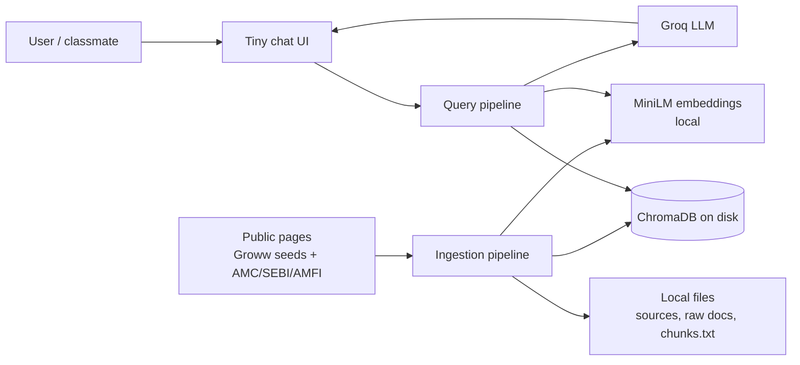
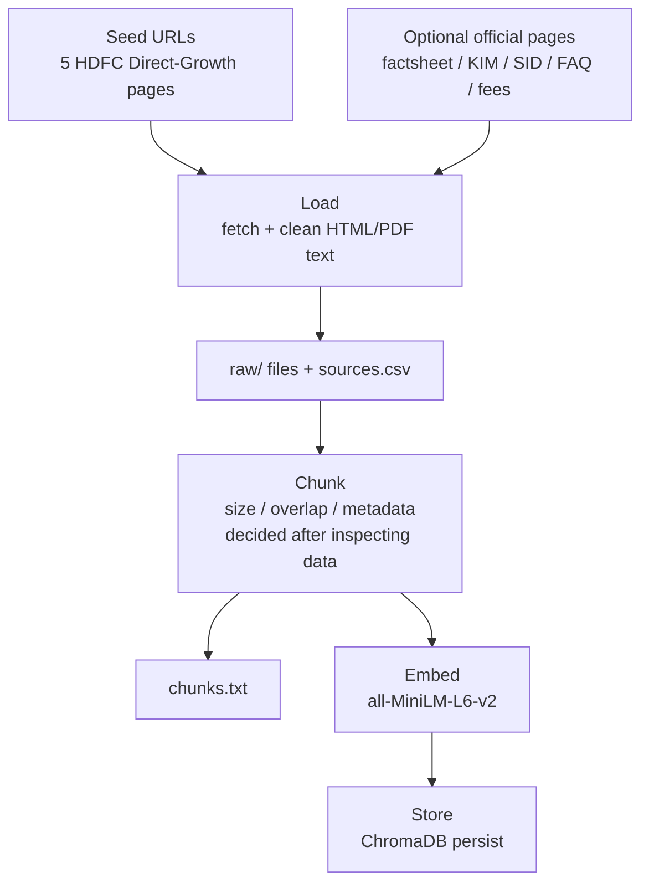
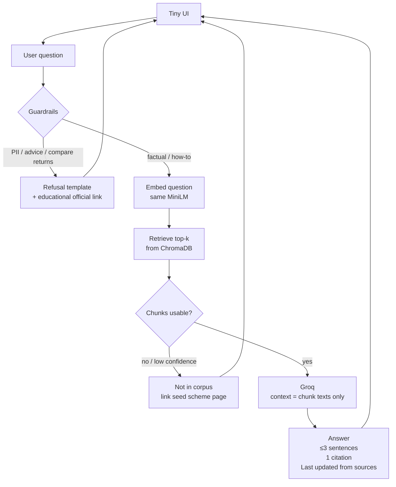
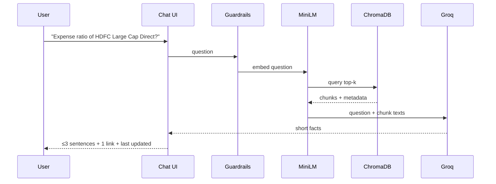

# Architecture

**Product:** Mutual Fund FAQs — Facts-Only RAG Chatbot  
**Based on:** [PRD.md](./PRD.md)  
**Version:** 0.1  
**Date:** 1 October 2026

This document describes **how** the demo is built. Product rules (what we answer, refuse, and submit) live in the PRD. Architecture rule: **ingestion and query are separate pipelines**. Do not collapse the system into “paste URLs into an LLM.”

---

## 1. Design principles

1. **Two pipelines, not one blob.** Load → Chunk → Embed → Store is offline. Question → Embed → Retrieve → Generate is online.
2. **Same embedding space.** Chunks and questions both use `sentence-transformers/all-MiniLM-L6-v2` (384 dimensions).
3. **Persist once.** ChromaDB on disk; the UI does not re-ingest on every restart.
4. **Inspectable RAG.** Raw pages, chunks `.txt`, source list, and vector store are artifacts you can open in class.
5. **Ground or refuse.** The LLM may only use retrieved chunk text. Empty/low-confidence retrieval → “not in corpus,” no invented numbers.
6. **Guardrails before generation.** Advice, performance comparison, and PII never reach Groq as a “please answer this” task.
7. **Secrets stay local.** `GROQ_API_KEY` in `.env` only.

---

## 2. System context



**Actors**

| Actor | Role |
| --- | --- |
| End user | Asks factual scheme questions in the tiny UI |
| Operator (you) | Runs ingestion once; hosts or records the demo |
| Groq | Generates ≤3-sentence answers from retrieved context |
| Public web | Sole allowed corpus origin |

No user accounts, no session store, no live NAV APIs.

---

## 3. High-level components

| Component | Responsibility | Runs when |
| --- | --- | --- |
| **Loader** | Fetch public pages; save raw text + metadata (`source_url`, title, `fetched_at`, scheme, category) | Ingestion |
| **Chunker** | Split documents; write inspectable `chunks.txt`; attach metadata per chunk | Ingestion |
| **Embedder** | MiniLM encode text → 384-d vectors | Ingestion **and** query |
| **Vector store** | ChromaDB collection; persist to disk | Ingestion write; query read |
| **Guardrails** | Classify / regex-screen: PII, advice, performance | Query (before retrieve) |
| **Retriever** | Embed question; top-k similarity search; return text + metadata | Query |
| **Generator** | Groq prompt: facts-only, ≤3 sentences, one citation, last-updated | Query |
| **UI** | Welcome, 3 examples, disclaimer, input, rendered answer | Query |

Suggested packaging for the demo: **Python** scripts for ingestion + a thin web UI (e.g. Streamlit) that only calls the query pipeline.

```
app/
  ingest.py              # Load → Chunk → Embed → Store
  query.py               # Question → guardrails → Embed → Retrieve → Groq
  embedder.py            # Shared MiniLM wrapper
  guardrails.py
  ui.py                  # Tiny chat
data/
  sources.csv            # URL list (deliverable)
  raw/                   # Saved page text
  chunks.txt             # Human-readable chunks (deliverable)
chroma/                  # Persisted vector DB (gitignored)
.env                     # GROQ_API_KEY (gitignored)
```

Exact folder names can change; the **stage split** cannot.

---

## 4. Pipeline A — Data ingestion (offline)

Run **once** (or when the corpus changes). The chatbot must start from the persisted store without crawling again.

```
Load → Chunk → Embed → Store
```



### 4.1 Load

- Start from the five PRD seed URLs.
- May follow links only to **official public** AMC / SEBI / AMFI documents (factsheet, KIM/SID, FAQs, charges, riskometer/benchmark, statement/tax guides).
- Do **not** load third-party blogs or app back-end screenshots.
- Persist each document locally so ingestion is reproducible without recrawl.
- Metadata at document level: `source_url`, `scheme_name`, `category`, `title`, `fetched_at`.

### 4.2 Chunk

Chunking is **data-driven** (PRD §8.3). **Before writing chunker code**, inspect `data/raw/` and record in `docs/chunking.md`:

- Why this strategy fits FAQ / factsheet vs long SID text
- Chunk size
- Overlap
- Metadata on every chunk: at least `source_url`, `scheme_name`, `category`, `fetched_at`; optionally `section` / heading

Then:

- Split documents into retrieval units
- Dump **all** chunks to a readable `.txt` (id, metadata, text) for class inspection
- Do not skip this file even if ChromaDB already holds the same text

### 4.3 Embed

- Model: `sentence-transformers/all-MiniLM-L6-v2`
- Input: chunk text (not the whole document)
- Output: 384-dimension vector per chunk
- Runs locally; no embedding API key

### 4.4 Store

- ChromaDB collection (e.g. `hdfc_mf_faqs`)
- Each record: `id`, `embedding`, `document` (chunk text), `metadata`
- Persistence directory on disk; gitignore the binary store
- Idempotent ingest: rebuild collection from `chunks.txt` / raw files rather than duplicating on every run

---

## 5. Pipeline B — Data retrieval and generation (online)

Runs **on every user question**. Does not fetch the live web at query time (corpus is the snapshot in ChromaDB).

```
Question → Embed → Retrieve top chunks → LLM → Answer
```

Guardrails sit on the question **before** embed/retrieve when the intent is clearly disallowed.



### 5.1 Question intake

UI sends raw text. No logging of PII. No multi-turn memory (each question is independent).

### 5.2 Guardrails (pre-retrieve)

| Signal | Behaviour |
| --- | --- |
| PAN / Aadhaar / account / OTP / email / phone | Do not store; refuse; point to AMC official channels |
| Buy / sell / switch / “best for me” / allocation | Refuse; educational official link |
| Compute or compare returns / “which performed better” | Do not compute; link official factsheet |

Implementation can be lightweight (keyword / regex + short instruction) for the demo; it must run **even if** retrieval would have found a chunk.

### 5.3 Embed (query)

Same MiniLM instance/model id as ingestion. Do not mix models.

### 5.4 Retrieve

- Similarity search in ChromaDB
- Return **top-k** chunks with metadata (`source_url`, `scheme_name`, `section`, `fetched_at`)
- **k** and a **minimum similarity** (or distance) threshold are implementation knobs; tune so weak matches do not get sent to Groq as “facts”
- Prefer chunks whose `scheme_name` matches an identified scheme in the question when disambiguation is needed

### 5.5 LLM (Groq)

- API key from `.env`
- System prompt encodes PRD policy: facts-only, ≤3 sentences, no advice, no invented numbers, use only provided context
- User payload: question + retrieved chunk texts + their URLs + `fetched_at`
- Model name: pick a current Groq chat model; document in README

### 5.6 Answer assembly

Every successful answer:

1. Body (≤3 sentences)
2. **One** citation URL (best matching chunk; prefer AMC/SEBI/AMFI over a listing page when both exist)
3. `Last updated from sources: <date>` from chunk `fetched_at` (oldest or max date — pick one rule and stick to it)

UI always shows: welcome, 3 example questions, **“Facts-only. No investment advice.”**

---

## 6. Data model

### 6.1 Source row (`sources.csv` / MD)

| Field | Meaning |
| --- | --- |
| url | Canonical public URL |
| scheme_name | e.g. HDFC Large Cap Fund |
| category | Large Cap / Flexi Cap / ELSS / Small Cap / Hybrid |
| doc_type | scheme_page / factsheet / kim / sid / faq / fees / statement_guide |
| fetched_at | ISO date of snapshot |

### 6.2 Chunk (Chroma metadata + `chunks.txt`)

| Field | Meaning |
| --- | --- |
| chunk_id | Stable id |
| text | Retrieval unit |
| source_url | Citation candidate |
| scheme_name | |
| category | |
| fetched_at | |
| section | Optional heading |

### 6.3 Query result (UI)

| Field | Meaning |
| --- | --- |
| kind | `answer` / `refusal` / `not_found` |
| text | Display body |
| citation_url | One link (or educational link on refusal) |
| last_updated | Date string when `kind = answer` |

---

## 7. Embedding and vector store contract

| Item | Contract |
| --- | --- |
| Model | `sentence-transformers/all-MiniLM-L6-v2` |
| Dimensions | 384 |
| Distance | Cosine (or Chroma default equivalent — document the choice) |
| Collection | One collection for this demo |
| Lifecycle | Ingest writes; UI only reads |

---

## 8. Security and compliance (architecture)

| Concern | How it is enforced |
| --- | --- |
| Secrets | `.env` + gitignore; never in source list or chunks |
| PII | Guardrail; no DB table for users; no chat logs of identifiers |
| Source policy | Loader allowlist: seed URLs + official domains you document |
| Advice / performance | Guardrail + generator system prompt (defense in depth) |
| Stale facts | `fetched_at` shown as last-updated; recrawl is a **new ingest**, not query-time scrape |

---

## 9. Sequence (happy path)



Ingestion is **not** on this path. It already happened.

---

## 10. Failure modes

| Case | System behaviour |
| --- | --- |
| Chroma path missing / empty collection | UI error: run ingestion first |
| Groq down / bad key | Show config error; do not fall back to ungrounded local guessing |
| No chunks above threshold | `not_found` + seed scheme URL |
| Ambiguous scheme (“expense ratio?” with no fund name) | Ask to name the scheme **or** retrieve and say which scheme the citation refers to — do not blend five funds into one number |
| Mixed in-scope + advice (“expense ratio and should I buy?”) | Answer the fact if retrievable **or** refuse the advice part clearly; never recommend |

---

## 11. Mapping to PRD requirements

| PRD | Architecture |
| --- | --- |
| F1 Load corpus | Loader + `data/raw` |
| F2 Chunk + `.txt` | Chunker + `chunks.txt` |
| F3 MiniLM | Shared embedder |
| F4 Chroma persist | Store stage |
| F5 Query path | Pipeline B |
| F6 Ground + one URL | Retriever metadata → answer assembly |
| F7 Length + last-updated | Generator prompt + UI fields |
| F8–F10 Guardrails | Pre-retrieve + prompt |
| F11 `.env` | Groq client config |
| G4 Show RAG stages | Separate `ingest.py` / `query.py` + this doc |

---

## 12. Open architecture decisions

Record the chosen values in README / `docs/chunking.md` when implementation starts:

| Decision | Constraint |
| --- | --- |
| Chunk size, overlap, section metadata | After inspecting raw pages |
| Top-k and similarity cutoff | Must avoid ungrounded generation |
| Groq model id | Current Groq chat model |
| UI framework | Tiny (welcome + 3 examples + disclaimer) |
| HTML vs PDF parsing | Whatever the extra official docs need |
| Last-updated rule | e.g. max `fetched_at` among used chunks |

---

## 13. What this architecture deliberately omits

- Query-time web search or agents
- Conversation memory
- Auth, CRM, analytics
- Recrawl scheduler
- Multiple embedding models or hosted vector DBs
- Streaming tokens (optional later; not required for the demo)
